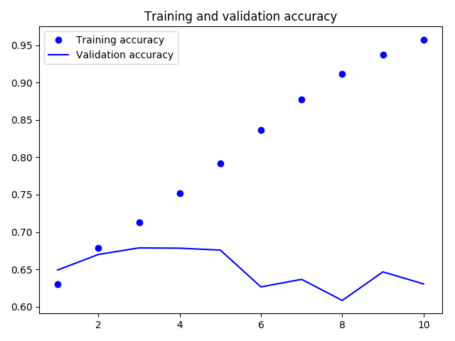
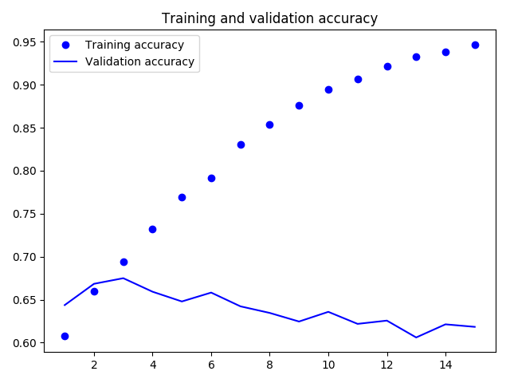

# Signals_Systems_Amazon_NLP
Natural Language Processing project for 625.260 - Fall 2018

## What is this?
This is my final project for Introduction to Signals and Systems, Fall 2018. Using the Keras library, I've built a Recurrent Neural Network which leverages Long Short-Term Memory to perform an analysis on the Amazon Review dataset organized and deduplicated by Julian McAuley. Neural networks extend a topic learned in class - specifically Kalman filters. In the case of non-linear Kalman filters, neural networks are general-purpose extended Kalman filters with nonlinearities (tanh, ReLu) between layers. There is some work to use neural networks to learn Kalman filter parameters [by Coksun et al.](https://zapdf.com/long-short-term-memory-kalman-filters-recurrent-neural-estim.html) but we do not pursue this method at this time.

This neural network seeks to take up to 300 words of a review and output an estimated score based on those reviews. Although we are not solving a novel problem, it provides a good framework for sentiment classification that may boil down a longwinded review (or README.md) into an easy to understand 1-5 (or in the case of our model, 0-4) score. We could likely extend this architecture into a recommender system off of the same dataset.

## Network architecture
The network architecture here is fairly simple, using the 300d glove vectors provided by [GloVe](https://nlp.stanford.edu/projects/glove/) at Stanford university to form an embedding for the [Amazon product data](http://jmcauley.ucsd.edu/data/amazon/) graciously curated and provided by Julian McAuley. The input that is mapped by the aforementioned embedding is then passed to two of Keras's Long Short-Term Memory layers. These initial two layers are followed by Dropout layer, which will "deactivate" some number of neurons (in this case, 20% of our neurons), which seeks to reduce overfitting of our model, and a third LSTM layer before being evaluated by a softmax to assess what "score" the input should receive. 

Neural networks come in many forms, from a more simple perceptron (that is, a single layer linear classifier) to convolutional and recurrent neural nets. Most neural nets flow in only one direction, from input to output. These neural nets are extremely powerful, but each neuron knows only about the inputs it receives and has no context about the larger system. For sequence data such as time series and text, this isn't ideal, and so recurrent neural networks were developed by John Hopfield. Many subcategories of RNN exist, and we chose to use Long Short-Term Memory, as developed by Hochreiter and Schmidhuber in the 90s.

A Long Short-Term Memory is particularly interesting from the perspective of feedback systems. Essentially, they are a standard neuron within a neural net, but also contain "gates" which allow the neural net to maintain some level of context around sequence data. As mentioned, these relate to Kalman filters, but have a more general and nonlinear view. 

Credit to Jitong Chen and DeLiang Wang for the diagram.

Credit to Jitong Chen and DeLiang Wang for the diagram.

The key feature of LSTMs is the cell state, which provides "memory" from neuron to neuron at different layers in the network. A series of gates will determine what to "remember" between neurons. The forget gate (ft) uses a [Sigmoid function](http://mathworld.wolfram.com/SigmoidFunction.html) to provide a decision, from a "definitely forget this" of 0 to "definitely remember this" of 1. Next, we make a decision about whether or not any new candidate data should be added to the cell. Another sigmoid, the input gate it indicates which values to update, and a tanh layer provides candidate values C_tildet. The cell valued Ct are based on the effect of the forget gate on the previous cell values plus the input gate's effect on the candidate values. This provides an input to another gate, the output gate, which is another sigmoid that uses a hidden state vector from t-1 and the current input on the weights and biases of the neuron. This output gate value is then multiplied by a tanh nonlinearity on the cell state Ct to provide the hidden state vector for the next cell.

## Performance of this particular model
One of the drawbacks of neural nets is their extremely long training time, especially on an average desktop or laptop copmuter. All of these models were trained on a 2018-model MacBook pro, and so a less performant machine (most consumer grade laptops and desktops) would require even more training time. Each epoch took about one hour with 100,000 inputs and a batch size of 256 and would have taken much longer with the full set of Amazon data. 

The results above are from 10 training epochs with a batch size of 128 and 15 training epochs with a batch size of 256, respectively. The training accuracy for the training set seems good, but the validation accuracy never seems to get better on either batch size or training epoch. Although the RNN works conceptually very well for our task, we seem to be overfitting the training data. Modifying our network architecture to increase dropout, or reducing the number of neurons in each layer could help. We might also want to consider freezing our word embeddings, making them non-trainable.

### Citations
R. He, J. McAuley. Modeling the visual evolution of fashion trends with one-class collaborative filtering. WWW, 2016

J. McAuley, C. Targett, J. Shi, A. van den Hengel. Image-based recommendations on styles and substitutes. SIGIR, 2015

J. Chen, D. Wang. Long Short-Term Memory for Speaker Generalization in Supervised Speech Separation. 2016

F. Chollet. Deep Learning with Python. 2017
